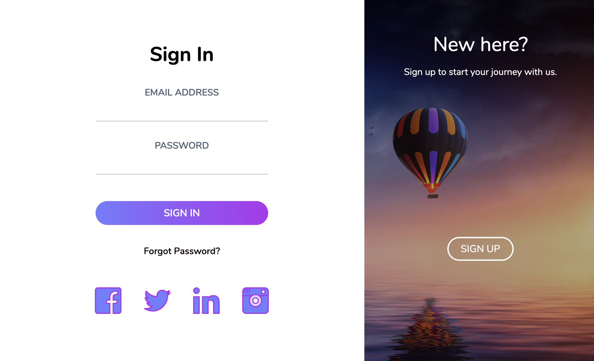
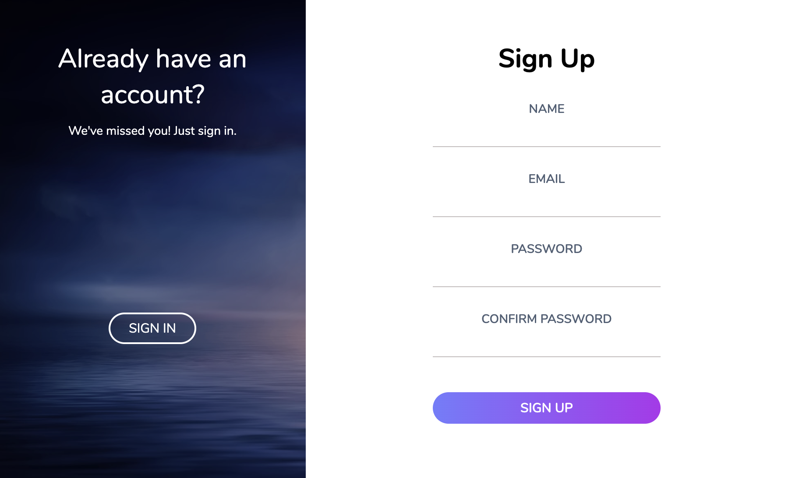

# Sliding Doors

## Table of Contents
*  [Description](#description)
*  [User Story](#user-story)
*  [Features of the Application](#features-of-the-application)
*  [Preview of Sliding Doors](#preview-of-sliding-doors)
*  [Links](#links)
*  [License](#license)
*  [Contributing](#contributing)
*  [Questions](#questions)

## Description

Sliding Doors is a dynamic, animated login form, where the user is able to toggle between the Sign In page and Sign Up page. The switch between the login and register forms is animated as both forms will exchange their positions dependent on how the user interacts with the application.

Sliding Doors features HTML, CSS, and the use of event listeners with Javascript, so that when certain buttons are clicked, a transition occurs between the Sign Up page and the Sign In page.

## User Story
~~~
AS A user  
I WANT to dynamically access a Sign In or Sign Up page  
SO THAT I can interact with an application and sign into or sign up for an account.  
~~~

## Features of the Application
~~~
GIVEN a Sign In or Sign Up page  
WHEN I click on the Sign Up button (if already on the Sign In page)  
THEN the page will toggle to the Sign Up page.  

WHEN I click on the Sign In button (if already on the Sign Up page)  
THEN the page will toggle to the Sign In page.  
~~~

## Preview of Sliding Doors

The following animation demonstrates the application functionality:

## Links
- [Deployed Application](https://rh9891.github.io/SlidingDoors)
- [Github Repository](https://github.com/rh9891/SlidingDoors)

## License

This application does not currently have any licenses.

The user is not permitted to use, modify, or share any parts of it. Though the code for this application is hosted on Github, where you are allowed to view and fork the code, this does not imply that the user is permitted to use, modify, or share the contents of this application for any purpose.

## Contributing

If you would like to contribute to this repository, please contact me via [Github](https://github.com/rh9891).

## Questions

If you have any questions, comments, or issues regarding this application, please do not hesitate to contact me via [Github](https://github.com/rh9891).